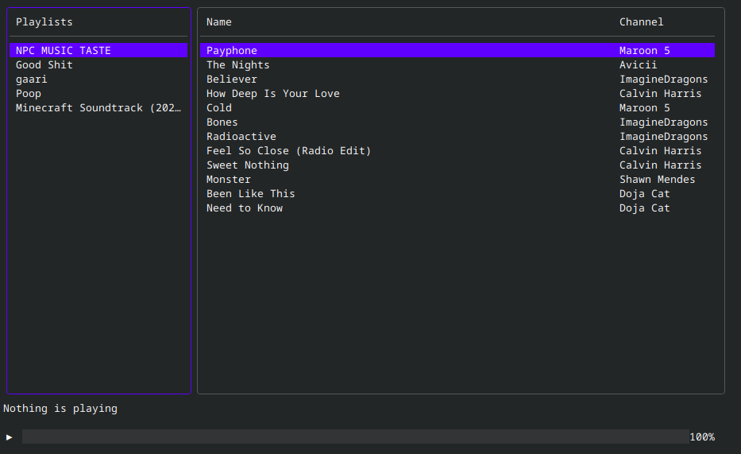

<div style="text-align: center;">
  <h1>Youtube-Music TUI <br /></h1>

  <div>
    <a href="https://github.com/BrownNpc/Youtube-Music-TUI">
      
    </a>
  </div>

  <h3>Youtube Music from the Terminal. 💻🎵</h3>

  
</div>

## Features ✨
- Playlist support
- Suffle Playlist
- Loop Playlist
- ~~Discord Presence~~   (Planned)
- ~~Customizable Theme~~ (Planned)
- ~~Builtin Search~~ (Planned)


### Installation

- [Linux](docs/install/Linux.md)
- [Windows](docs/install/Windows.md)
- Mac

# Getting Started

Run ```ytt``` to launch the app.


###### You can type ``ytt -h`` for the help message

```
usage:	ytt [options]
options:
  -h, help, --help       Show this help message
  -c, config, --config   Open config file folder
  -r, refresh, --refresh Refresh the playlist cache
  -v, version, --version Show version and information
```

### Controls
##### **Navigation**

`tab` Switch section

`k`/`↑` Up

`j`/`↓` Down

`Home` Scroll to top

`End` Scroll to bottom

`Enter` Select, Start a track

`Ctrl+C`/`Command+C` Quit

##### **Playback**

`space` Play/Pause

`→` Seek 10s forwards

`←` Seek 10s backwards

`,` Volume down

`.` Volume up

`s` Toggle shuffle

------

